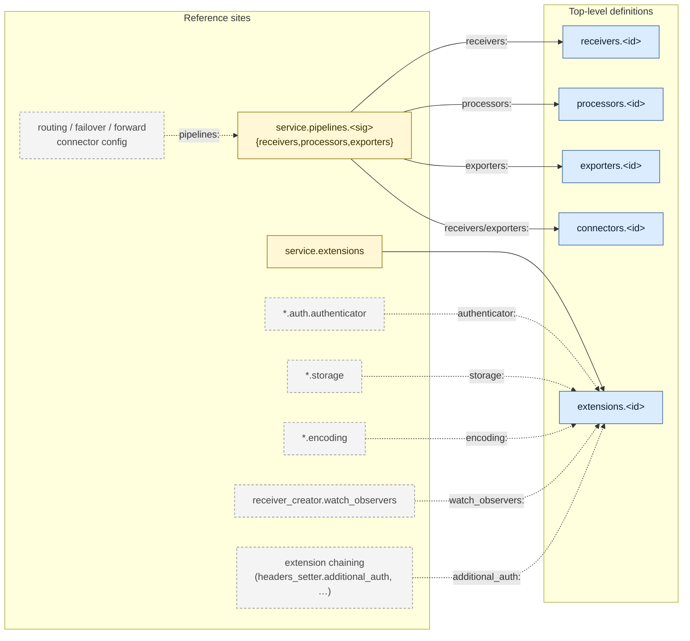

# `otelcol-lang`

Editor tooling for [OpenTelemetry Collector][otelcol] configurations:
a VS Code extension with syntax highlighting, completion, hover docs,
diagnostics, and embedded OTTL support.

[otelcol]: https://github.com/open-telemetry/opentelemetry-collector

## Schemas

The JSON Schemas this extension uses for validation, hover and
completion are produced by a separate project:

→ [`otelcol-schemas`](https://github.com/otelery/otelcol-schemas)

They are bundled into the published `.vsix` at build time (see [Schema
source](#schema-source) below). A future release will gain the ability
to fetch schemas from a pinned release tag of `otelcol-schemas` at
runtime; the `otelcol.schemaSource` setting is reserved for that
purpose (no effect in v0.1.0).

The current bundle covers seven distributions: `otelcol`,
`otelcol-contrib`, `otelcol-k8s`, `otelcol-otlp`,
`otelcol-ebpf-profiler`, `datadog-otelcol`, `elastic-otelcol`.

## Installation

Install the latest `vscode-otelcol-<version>.vsix` from the project's
GitHub Releases, or via the VS Code Marketplace once published.

## Usage

Open any YAML file that looks like an OpenTelemetry Collector
configuration. The language is detected automatically by either:

- a first-line comment such as `# otelcol` or `# opentelemetry-collector`, or
- a recognised filename pattern (declared per distribution in the
  schemas repo's `distributions.yaml`).

You can also pin a distribution explicitly via the `# yaml-language-server:`
pragma:

```yaml
# yaml-language-server: $schema=https://raw.githubusercontent.com/otelery/otelcol-schemas/main/schemas/json/datadog-otelcol-config-0.152.0.json
receivers:
  otlp:
```

## Repo layout

```
otelcol-lang/
├── package.json                              VS Code extension manifest
├── language-configuration.json
├── syntaxes/
│   ├── otelcol-yaml.tmLanguage.json          YAML + OTTL injection
│   └── ottl.tmLanguage.json                  vendored from ottl-lang
├── scripts/
│   ├── copy-schemas.mjs                      copies schemas into out/ or dist/ at build time
│   ├── check-runtime-paths.mjs               build-time sanity check
│   ├── smoke.mjs                             headless validator
│   └── hover-probe.mjs                       hover diagnostic tool
├── schemas/                                  vendored from otelcol-schemas; committed
│   ├── distributions/                         per-distribution component metadata index
│   └── json/                                  publishable JSON Schemas + catalog
└── src/
    ├── extension/extension.ts                VS Code client
    └── server/                               LSP
```

## Schema source

The schemas under `schemas/` are **vendored** from
[otelery/otelcol-schemas](https://github.com/otelery/otelcol-schemas)
and committed to this repo. Clone-and-build works with no external
checkout. The build step (`scripts/copy-schemas.mjs`) copies them
into `./out/schemas/` (for unit tests) and `./dist/schemas/` (for the
bundled `.vsix`) so the LSP finds them next to the compiled server.

Refreshing the vendored schemas (when upstream OTel distributions
release new versions):

```sh
# from a sibling otelcol-schemas checkout that has run `npm run build:all`:
cp -r ../otelcol-schemas/schemas/distributions/* schemas/distributions/
cp -r ../otelcol-schemas/schemas/json/*           schemas/json/
```

Review the diff, then commit. There is intentionally no auto-fetch —
schema updates are reviewed events, not silent build artefacts.

The `otelcol.schemaSource` setting (reserved) will, in a future
release, let the extension download schemas from an HTTPS URL or
pinned `otelcol-schemas` release tag instead of using the bundled
copy. In v0.1.0 the setting has no behaviour.

## Build

```sh
npm install
npm run build
# = tsc + copy-schemas
```

| script                    | does                                              |
| ------------------------- | ------------------------------------------------- |
| `npm run build`           | `tsc` + copy schemas into `out/` (for unit tests) |
| `npm run package`         | production esbuild bundle into `dist/`            |
| `npm run package:vsix`    | produce a `.vsix` (requires `vsce`)               |
| `npm run smoke -- <file>` | parse a yaml, print model + diagnostics           |
| `npm run test`            | full LSP fixture suite                            |

## LSP

The extension picks a distribution via the `otelcol.distribution`
setting (enum of the registry slugs; default `otelcol-contrib`). On
config change the server reloads its component index. All other
features — hover with codeowners / warnings / feature gates from
`metadata.yaml`, pipeline graph validation, OTTL forwarding — are
distribution-agnostic.

### Settings

| key                                  | description                                                                                    |
| ------------------------------------ | ---------------------------------------------------------------------------------------------- |
| `otelcol.distribution`               | Which distribution to validate against (default `otelcol-contrib`)                             |
| `otelcol.schemaSource`               | Reserved for future use (HTTPS URL or release tag for schemas). No effect in v0.1.0.           |
| `otelcol.contribPath`                | Optional local contrib checkout for richer hover (rare)                                        |
| `otelcol.ottlLspPath`                | Path to `ottl-lsp`'s compiled `server.js` for embedded OTTL diagnostics                        |
| `otelcol.configSets.autoDiscover`    | Discover config sets by walking the workspace for `service.pipelines` anchors (default `true`) |
| `otelcol.configSets.maxFilesScanned` | Safety bound on the workspace walk (default `2000`)                                            |
| `otelcol.trace.server`               | LSP trace verbosity                                                                            |

## Cross-file references

The LSP resolves IDs across every member of a discovered **config set**
(anchored on `service.pipelines:`, members are sibling fragments and
subdirectory files; explicit overrides via `otelcol-configset.yaml`
sidecar or first-line `# otelcol-configset:` directive). The graph below
shows which reference sites resolve to which definition maps. Solid
edges are implemented today; dashed edges are upstream patterns on the
roadmap.



### What's wired today

| Reference site                                             | Resolves to                                                 | Features                                     |
| ---------------------------------------------------------- | ----------------------------------------------------------- | -------------------------------------------- |
| `service.pipelines.<sig>.{receivers,processors,exporters}` | `receivers` / `processors` / `exporters` / `connectors` map | hover, F12, find-refs, codelens, diagnostics |
| `service.extensions`                                       | `extensions` map                                            | hover, F12, find-refs, codelens, diagnostics |

Diagnostics include: undefined reference, ambiguous reference
(duplicate id across files), defined-but-unused (greyed via
`DiagnosticTag.Unnecessary`), and signal-compatibility checks for
pipeline refs.

### Roadmap (dashed edges)

Each remaining pattern is a single string field whose value names a
component id (or pipeline id for routing-style connectors). The shape
mirrors `service.extensions:`, so adding them is mechanical: parse the
ref into `DocModel`, union into `SetModel`, branch in `pipelineRefsTo`,
extend the validator. See `src/server/usage.ts` and
`src/server/yaml-model.ts` for the existing pattern.

## Architecture

The extension follows the language-injection + virtual-document pattern
(YAML grammar injects `source.ottl` into OTTL-bearing keys; LSP
forwards each OTTL string to `ottl-lsp` and translates diagnostic
ranges back). Distribution support is layered cleanly on top: the
schemas live in their own repo, and the LSP just consumes the
generated per-distribution index at runtime.
