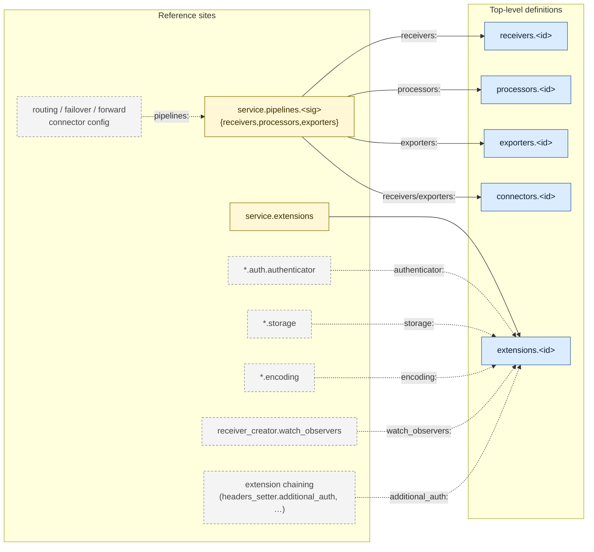

# `otelcol-lang`

Editor tooling for [OpenTelemetry Collector][otelcol] configurations:
syntax highlighting, completion, hover docs, diagnostics, cross-file
references, and embedded OTTL support — delivered through a shared
LSP server plus one integration per supported editor.

[otelcol]: https://github.com/open-telemetry/opentelemetry-collector

## Supported editors

| Editor    | Status   | Integration                                          | Per-editor README                                    |
| --------- | -------- | ---------------------------------------------------- | ---------------------------------------------------- |
| VS Code   | original | Bundled extension (TextMate grammar + LSP)           | [`editors/vscode/`](editors/vscode/README.md)        |
| Zed       | v0.1     | Rust → WASM extension; LSP via PATH                  | [`editors/zed/`](editors/zed/README.md)              |
| Helix     | v0.1     | `languages.toml` + tree-sitter queries; LSP via PATH | [`editors/helix/`](editors/helix/README.md)          |
| JetBrains | v0.1     | LSP4IJ-based plugin; TextMate grammar bundle         | [`editors/jetbrains/`](editors/jetbrains/README.md)  |
| Neovim    | sketch   | Notes only — no shipped integration yet              | [`editors/neovim/NOTES.md`](editors/neovim/NOTES.md) |

The LSP server (`src/server/`), shared YAML classifier (`src/common/`),
TextMate grammars (`syntaxes/`), and test fixtures (`test/`) live at
the repo root and are reused across every editor. Cross-editor design
notes: [`editors/SHARED.md`](editors/SHARED.md).

## Schemas

The JSON Schemas this extension uses for validation, hover and
completion are produced by a separate project:

→ [`otelcol-schemas`](https://github.com/otelery/otelcol-schemas)

They are bundled into the published `.vsix` at build time (see [Schema
source](#schema-source) below). A future release will gain the ability
to fetch schemas from a pinned release tag of `otelcol-schemas` at
runtime; the `otelcol.schemaSource` setting is reserved for that
purpose (no effect in v0.1.0).

The current bundle covers seven distributions: `otelcol`,
`otelcol-contrib`, `otelcol-k8s`, `otelcol-otlp`,
`otelcol-ebpf-profiler`, `datadog-otelcol`, `elastic-otelcol`.

## Installation

Per editor, install the artefact produced by `make package-<editor>`
(see [Build & test as a local package](#build--test-as-a-local-package-per-editor)
below), or grab a pre-built one from the project's GitHub Releases.

## Usage

Open any YAML file that looks like an OpenTelemetry Collector
configuration. The language is detected automatically by either:

- a first-line comment such as `# otelcol` or `# opentelemetry-collector`, or
- a recognised filename pattern (declared per distribution in the
  schemas repo's `distributions.yaml`).

You can also pin a distribution explicitly via the `# yaml-language-server:`
pragma:

```yaml
# yaml-language-server: $schema=https://raw.githubusercontent.com/otelery/otelcol-schemas/main/schemas/json/datadog-otelcol-config-0.152.0.json
receivers:
  otlp:
```

## Repo layout

```
otelcol-lang/
├── package.json                              Shared manifest: VS Code extension + npm bin for the LSP server
├── syntaxes/
│   ├── otelcol-yaml.tmLanguage.json          YAML + OTTL injection (VS Code + JetBrains)
│   └── ottl.tmLanguage.json                  vendored from ottl-lang
├── src/
│   ├── common/                               shared YAML classifier (sniffer)
│   └── server/                               LSP server (transport-agnostic)
├── bin/
│   └── otelcol-language-server                stdio shim used by Zed/Helix/JetBrains/Neovim
├── editors/
│   ├── vscode/                               VS Code extension (client + tests + language-configuration)
│   ├── zed/                                  Rust → WASM extension + language config + queries
│   ├── helix/                                languages.toml + runtime/queries/
│   ├── jetbrains/                            Gradle/Kotlin LSP4IJ plugin
│   └── neovim/                               notes (no shipped integration)
├── schemas/                                  vendored from otelcol-schemas
│   ├── distributions/                         per-distribution component metadata index
│   └── json/                                  publishable JSON Schemas + catalog
├── scripts/
│   ├── copy-schemas.mjs                      copies schemas into out/ or dist/ at build time
│   ├── check-runtime-paths.mjs               build-time sanity check
│   ├── smoke.mjs                             headless validator
│   └── smoke-stdio.mjs                       end-to-end stdio handshake smoke
└── test/                                     shared fixture workspaces (simple/, complex/, configsets/)
```

## Schema source

The schemas under `schemas/` are **vendored** from
[otelery/otelcol-schemas](https://github.com/otelery/otelcol-schemas)
and committed to this repo. Clone-and-build works with no external
checkout. The build step (`scripts/copy-schemas.mjs`) copies them
into `./out/schemas/` (for unit tests) and `./dist/schemas/` (for the
bundled `.vsix`) so the LSP finds them next to the compiled server.

Refreshing the vendored schemas (when upstream OTel distributions
release new versions):

```sh
# from a sibling otelcol-schemas checkout (after running its build):
cp -r ../otelcol-schemas/schemas/distributions/* schemas/distributions/
cp -r ../otelcol-schemas/schemas/json/*           schemas/json/
```

Review the diff, then commit. There is intentionally no auto-fetch —
schema updates are reviewed events, not silent build artefacts.

The `otelcol.schemaSource` setting (reserved) will, in a future
release, let the extension download schemas from an HTTPS URL or
pinned `otelcol-schemas` release tag instead of using the bundled
copy. In v0.1.0 the setting has no behaviour.

## Build

One-time setup:

```sh
make install        # npm install
make build          # tsc + copy schemas into out/ (powers unit tests)
make bundle         # esbuild → dist/extension + dist/server + dist/schemas
```

Common shared targets (run `make help` for the full list):

| target                    | does                                                     |
| ------------------------- | -------------------------------------------------------- |
| `make build`              | `tsc` + copy schemas into `out/` (for unit tests)        |
| `make bundle`             | production esbuild bundle into `dist/`                   |
| `make test-unit`          | LSP modules in isolation (node --test, fast)             |
| `make test-stdio`         | end-to-end LSP handshake over stdio (`bin/` smoke)       |
| `make test-editors`       | every per-editor suite + the stdio smoke                 |
| `make test`               | `test-unit` + `test-editors`                             |
| `make check`              | all quality gates (CI entry-point)                       |
| `make package`            | build every editor's distributable into `dist/packages/` |
| `npm run smoke -- <file>` | parse a yaml, print model + diagnostics                  |

### Per-editor build / test / package

| Editor    | Build                  | Test                                              | Package (writes to `dist/packages/`)                |
| --------- | ---------------------- | ------------------------------------------------- | --------------------------------------------------- |
| VS Code   | `make bundle`          | `make test-vscode`                                | `make package-vscode` → `.vsix`                     |
| Zed       | `make build-zed`       | `make test-zed`                                   | `make package-zed` → `.tar.gz` (WASM + config)      |
| Helix     | (config only)          | `make test-helix` / `make test-helix-integration` | `make package-helix` → `.tar.gz` (config + queries) |
| JetBrains | `make build-jetbrains` | `make test-jetbrains`                             | `make package-jetbrains` → plugin `.zip`            |

`make package` runs all four package targets at once.

## Build & test as a local package per editor

Every editor can be installed from the artefacts in `dist/packages/`
without touching the Marketplace, JetBrains repository, or any other
remote registry. The pattern is always: `make package-<editor>` →
install the resulting file into the editor.

### VS Code

```sh
make package-vscode
# → dist/packages/opentelemetry-collector-config-<version>.vsix

# install into your local VS Code:
code --install-extension dist/packages/opentelemetry-collector-config-*.vsix
# or: Extensions view → "…" menu → "Install from VSIX…"
```

To iterate without packaging, run the extension straight from the
checkout (no install needed):

```sh
make bundle
code --extensionDevelopmentPath="$(pwd)" examples/
```

### Zed

Zed's "Install Dev Extension" loads the source directory; it does not
consume a packaged archive. Use it for iteration:

1. Open Zed → `Extensions` (`cmd/ctrl-shift-x`) →
   `Install Dev Extension` → pick `editors/zed/`.
2. Zed compiles the Rust crate to WASM and registers the language.

For a reproducible artefact (release WASM + config bundle) suitable
for sharing or attaching to a release:

```sh
make package-zed
# → dist/packages/otelcol-zed-<version>.tar.gz
```

The Zed extension shells out to `otelcol-language-server` on `PATH`,
so first install the server locally:

```sh
npm pack                                  # → opentelemetry-collector-config-<version>.tgz
npm i -g ./opentelemetry-collector-config-*.tgz           # exposes otelcol-language-server
which otelcol-language-server
```

### Helix

Helix has no plugin format — the "package" is a tarball of config and
queries that the user extracts into `~/.config/helix/`:

```sh
make package-helix
# → dist/packages/otelcol-helix-<version>.tar.gz

# install:
tar xzf dist/packages/otelcol-helix-*.tar.gz -C ~/.config/helix/
```

The server also needs to be on `PATH` (same `npm i -g ./opentelemetry-collector-config-*.tgz`
step as for Zed). See [`editors/helix/README.md`](editors/helix/README.md)
for the symlink-based dev variant that lets query edits flow through
without re-packaging.

### JetBrains

```sh
make package-jetbrains
# → dist/packages/<plugin-id>-<version>.zip
```

Install in the IDE: `Settings → Plugins → ⚙ → Install Plugin from
Disk…` → pick the `.zip`. The plugin depends on **LSP4IJ**, which
the IDE will offer to install on first launch if it isn't already
present. The bundled `server.js` is extracted from the plugin jar to
`~/.cache/JetBrains/<IDE>/otelcol-language-server/<version>/`; the
extraction is keyed by a content hash (`manifest.sha256`) so
reinstalling a newer plugin invalidates the cache automatically — no
manual `rm -rf` step. A `node` binary on the user's shell PATH is the
only external dependency.

**Node discovery.** `OtelcolLspServerFactory.resolveNode()` uses
`com.intellij.execution.configurations.PathEnvironmentVariableUtil.findInPath`
against the shell-inherited PATH (`EnvironmentUtil.getValue("PATH")`),
which is necessary because GUI-launched IDEs on macOS/Linux otherwise
inherit a stripped PATH that excludes Homebrew, nvm, `/usr/local/bin`,
etc. Falls back to the literal `"node"` if lookup fails.

**Server JS override channels** (priority order):

| Channel                              | Lifetime         | Use                                |
| ------------------------------------ | ---------------- | ---------------------------------- |
| `-Dotelcol.lsp.command="…"`          | Process lifetime | Full executable override; tests    |
| `-Dotelcol.lsp.server="…"`           | Process lifetime | Source-tree `server.js` during dev |
| `otelcol.lsp.server.path` (Registry) | Across restarts  | Persistent override on any IDE     |
| _(none)_                             | —                | Bundled extraction (production)    |

`-Dotelcol.lsp.node="…"` overrides the resolved Node binary
independently.

**Sandbox IDE for plugin development:**

```sh
make runide-jetbrains
```

Bundles the server and launches a sandbox IntelliJ with `examples/`
opened as the project and `-Dotelcol.lsp.server=…/dist/server/server.js`
pre-wired. Override the project folder with
`./gradlew -p editors/jetbrains runIde -PsandboxProject=$(realpath test)`.

**Auto-restart on rebuild.** Set the unified environment variable
`OTELCOL_DEV_WATCH=1` to enable a file watcher on the active
`server.js`. The JetBrains plugin's `OtelcolDevWatcher`
`ProjectActivity` uses a NIO `WatchService` (300 ms debounce) and
calls `LanguageServerManager.stop + start` on change; the VS Code
extension uses `fs.watch` and calls `client.restart()`. Combined with
`npm run watch` (esbuild `--watch` rebuilds `dist/server/server.js` on
save), editing TS source automatically restarts the LSP process. Same
flag works in both editors — no editor auto-enables it via dev-mode
detection. The `make runide-jetbrains` target and the VS Code
"Run Extension" launch config both set `OTELCOL_DEV_WATCH=1` already;
production installs are unaffected.

Manual restart fallback: **Tools → Restart otelcol Language Server**
(also available via _Find Action_).

Full dev-loop reference: [`docs/investigations/jetbrains-dev-loop.md`](docs/investigations/jetbrains-dev-loop.md).

### Sanity check across editors

After installing in any editor, the same smoke applies: open
`examples/simple/otelcol-config.yaml` (or copy it to
`otelcol-config.otelcol.yaml` if the editor lacks content sniffing —
see each per-editor README for the detection caveats), hover on a
`receivers:` key, and confirm Markdown component docs come back. A
broken pipeline reference should produce a diagnostic.

## Publishing to the VS Code Marketplace

The extension is published under the `otelery` publisher namespace.

**One-time setup** — authenticate against the Marketplace. Either log
in interactively (cached in your home dir):

```sh
npx vsce login otelery
# pastes a Personal Access Token from Azure DevOps; see:
# https://code.visualstudio.com/api/working-with-extensions/publishing-extension#get-a-personal-access-token
```

Or set the PAT as an environment variable per-publish (good for CI):

```sh
export VSCE_PAT=<token>
```

**Publish** — runs the full quality gate first, then `vsce publish`:

```sh
make publish              # current package.json version
# or bump and publish in one step:
make publish-patch        # 0.1.0 → 0.1.1
make publish-minor        # 0.1.0 → 0.2.0
make publish-major        # 0.1.0 → 1.0.0
```

`vsce publish` automatically runs `vscode:prepublish` (sync schemas
→ esbuild --production → copy to dist/), then uploads the produced
`.vsix`. The bump variants also commit and tag the version change.

For a local-only artefact without uploading:

```sh
make package      # writes opentelemetry-collector-config-<version>.vsix in the repo root
```

## LSP

The extension picks a distribution via the `otelcol.distribution`
setting (enum of the registry slugs; default `otelcol-contrib`). On
config change the server reloads its component index. All other
features — hover with codeowners / warnings / feature gates from
`metadata.yaml`, pipeline graph validation, OTTL forwarding — are
distribution-agnostic.

### Settings

| key                                  | description                                                                                    |
| ------------------------------------ | ---------------------------------------------------------------------------------------------- |
| `otelcol.distribution`               | Which distribution to validate against (default `otelcol-contrib`)                             |
| `otelcol.schemaSource`               | Reserved for future use (HTTPS URL or release tag for schemas). No effect in v0.1.0.           |
| `otelcol.contribPath`                | Optional local contrib checkout for richer hover (rare)                                        |
| `otelcol.ottlLspPath`                | Path to `ottl-lsp`'s compiled `server.js` for embedded OTTL diagnostics                        |
| `otelcol.configSets.autoDiscover`    | Discover config sets by walking the workspace for `service.pipelines` anchors (default `true`) |
| `otelcol.configSets.maxFilesScanned` | Safety bound on the workspace walk (default `2000`)                                            |
| `otelcol.trace.server`               | LSP trace verbosity                                                                            |

## Cross-file references

The LSP resolves IDs across every member of a discovered **config set**
(anchored on `service.pipelines:`, members are sibling fragments and
subdirectory files; explicit overrides via `otelcol-configset.yaml`
sidecar or first-line `# otelcol-configset:` directive). The graph below
shows which reference sites resolve to which definition maps. Solid
edges are implemented today; dashed edges are upstream patterns on the
roadmap.



### What's wired today

| Reference site                                             | Resolves to                                                 | Features                                     |
| ---------------------------------------------------------- | ----------------------------------------------------------- | -------------------------------------------- |
| `service.pipelines.<sig>.{receivers,processors,exporters}` | `receivers` / `processors` / `exporters` / `connectors` map | hover, F12, find-refs, codelens, diagnostics |
| `service.extensions`                                       | `extensions` map                                            | hover, F12, find-refs, codelens, diagnostics |

Diagnostics include: undefined reference, ambiguous reference
(duplicate id across files), defined-but-unused (greyed via
`DiagnosticTag.Unnecessary`), and signal-compatibility checks for
pipeline refs.

### Roadmap (dashed edges)

Each remaining pattern is a single string field whose value names a
component id (or pipeline id for routing-style connectors). The shape
mirrors `service.extensions:`, so adding them is mechanical: parse the
ref into `DocModel`, union into `SetModel`, branch in `pipelineRefsTo`,
extend the validator. See `src/server/usage.ts` and
`src/server/yaml-model.ts` for the existing pattern.

## Architecture

The extension follows the language-injection + virtual-document pattern
(YAML grammar injects `source.ottl` into OTTL-bearing keys; LSP
forwards each OTTL string to `ottl-lsp` and translates diagnostic
ranges back). Distribution support is layered cleanly on top: the
schemas live in their own repo, and the LSP just consumes the
generated per-distribution index at runtime.

### Single server, multiple editors

`src/server/` is a stdio language server built with esbuild into a
single `dist/server/server.js`. Every editor frontend talks to the
same bundle:

- **VS Code** — `src/extension/extension.ts` spawns it via `vscode-languageclient/node`.
- **JetBrains** — `editors/jetbrains/` uses LSP4IJ; `OtelcolLspServerFactory` constructs the `node server.js --stdio` command line.
- **Zed**, **Helix**, **Neovim** — point at the same `server.js` (or the `npm i -g` global) via stdio.

A bug fix or feature lands in one place and reaches every editor on
the next `make bundle`.

### Completion contexts (`src/server/completion.ts`)

Five branches, all driven by `pathAtPosition` (indent-aware, handles
blank-line cursors that the YAML AST has no node for):

1. **Value position** — cursor after `key: ` on the same line. If the
   key's resolved schema has an `enum`, surfaces those values.
2. **Top-level component map** (`receivers:` / `processors:` / …) —
   suggests known component types from the distribution index.
3. **Inside a component instance** (`receivers.otlp.<cursor>`) — walks
   the JSON Schema along the trailing path (`resolveRef`, `lookupProperty`)
   and emits property keys with `detail` (type/format/enum preview),
   markdown `documentation`, and snippet `insertText` that pre-fills
   schema defaults for scalars and expands `object` / `array` types
   onto an indented child line.
4. **`service.pipelines.<sig>`** — the bucket names `receivers`,
   `processors`, `exporters`.
5. **`service.pipelines.<sig>.{receivers,processors,exporters}`** —
   the defined IDs (cross-file aware via the set model).

Snippets use `\t` for the body indent so LSP clients expand it relative
to the cursor line — emitting literal spaces double-indents on most
clients.

### Configuration sets

`src/server/set-model.ts` discovers sibling `*.otelcol.yaml` files that
share a `service.pipelines` anchor and unions their definitions. Hover,
go-to-definition, find-references, and completion all consult the set
model so an exporter declared in `exporters.otelcol.yaml` is resolvable
from a `pipelines.otelcol.yaml` reference.

### Editor-side specifics

- **Content sniffing** (VS Code) — `src/extension/sniffer.ts` retags
  `*.yaml` files as `otelcol` when their content matches; the LSP
  server runs the same sniffer on the server side for editors that
  can't retag (`otelcol.sniffer.serverSide`).
- **Semantic tokens** — VS Code consumes the LSP semantic-tokens
  response directly; JetBrains adds `OtelcolSemanticTokensColorsProvider`
  to map the LSP token types onto the user's theme palette (otherwise
  LSP4IJ renders them as plain text).
- **Dev auto-restart** — both VS Code (`fs.watch` gated on
  `ExtensionMode.Development`) and JetBrains (`OtelcolDevWatcher`
  gated on an override path being set) watch `dist/server/server.js`
  and restart the client on change. Pairs with `npm run watch`.
