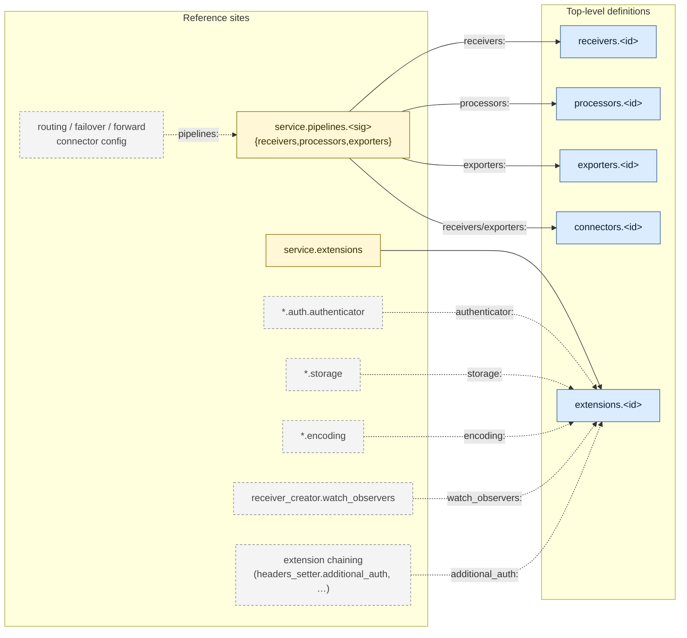

# Architecture

How `otelcol-lang` is put together: the repo layout, the LSP server and its settings, cross-file reference resolution, and the editor-injection design.

## Repo layout

```
otelcol-lang/
├── package.json                              Shared manifest: VS Code extension + npm bin for the LSP server
├── syntaxes/
│   ├── otelcol-yaml.tmLanguage.json          YAML + OTTL injection (VS Code + JetBrains)
│   └── ottl.tmLanguage.json                  vendored from ottl-lang
├── src/
│   ├── common/                               shared YAML classifier (sniffer)
│   └── server/                               LSP server (transport-agnostic)
├── bin/
│   └── otelcol-language-server                stdio shim used by Zed/Helix/JetBrains/Neovim
├── editors/
│   ├── vscode/                               VS Code extension (client + tests + language-configuration)
│   ├── zed/                                  Rust → WASM extension + language config + queries
│   ├── helix/                                languages.toml + runtime/queries/
│   ├── jetbrains/                            Gradle/Kotlin LSP4IJ plugin
│   └── neovim/                               notes (no shipped integration)
├── schemas/                                  vendored from otelcol-schemas
│   ├── distributions/                         per-distribution component metadata index
│   └── json/                                  publishable JSON Schemas + catalog
├── scripts/
│   ├── copy-schemas.mjs                      copies schemas into out/ or dist/ at build time
│   ├── check-runtime-paths.mjs               build-time sanity check
│   ├── smoke.mjs                             headless validator
│   └── smoke-stdio.mjs                       end-to-end stdio handshake smoke
└── test/                                     shared fixture workspaces (simple/, complex/, configsets/)
```

The LSP server (`src/server/`), shared YAML classifier (`src/common/`), TextMate grammars (`syntaxes/`), and test fixtures (`test/`) live at the repo root and are reused across every editor. Cross-editor design notes: [`editors/SHARED.md`](../editors/SHARED.md).

## LSP

The extension picks a distribution via the `otelcol.distribution` setting (enum of the registry slugs; default `otelcol-contrib`). On config change the server reloads its component index. All other features (hover with codeowners / warnings / feature gates from `metadata.yaml`, pipeline graph validation, OTTL forwarding) are distribution-agnostic.

### Settings

| key                                  | description                                                                                    |
| ------------------------------------ | ---------------------------------------------------------------------------------------------- |
| `otelcol.distribution`               | Which distribution to validate against (default `otelcol-contrib`)                             |
| `otelcol.schemaSource`               | Reserved for future use (HTTPS URL or release tag for schemas). No effect in v0.1.0.           |
| `otelcol.contribPath`                | Optional local contrib checkout for richer hover (rare)                                        |
| `otelcol.ottlLspPath`                | Path to `ottl-lsp`'s compiled `server.js` for embedded OTTL diagnostics                        |
| `otelcol.configSets.autoDiscover`    | Discover config sets by walking the workspace for `service.pipelines` anchors (default `true`) |
| `otelcol.configSets.maxFilesScanned` | Safety bound on the workspace walk (default `2000`)                                            |
| `otelcol.trace.server`               | LSP trace verbosity                                                                            |

## Cross-file references

The LSP resolves IDs across every member of a discovered **config set** (anchored on `service.pipelines:`, members are sibling fragments and subdirectory files; explicit overrides via `configset.otelcol.yaml` sidecar or first-line `# configset-otelcol:` directive). The graph below shows which reference sites resolve to which definition maps. Solid edges are implemented today; dashed edges are upstream patterns on the roadmap.



### What's wired today

| Reference site                                             | Resolves to                                                 | Features                                     |
| ---------------------------------------------------------- | ----------------------------------------------------------- | -------------------------------------------- |
| `service.pipelines.<sig>.{receivers,processors,exporters}` | `receivers` / `processors` / `exporters` / `connectors` map | hover, F12, find-refs, codelens, diagnostics |
| `service.extensions`                                       | `extensions` map                                            | hover, F12, find-refs, codelens, diagnostics |

Diagnostics include: undefined reference, ambiguous reference (duplicate id across files), defined-but-unused (greyed via `DiagnosticTag.Unnecessary`), and signal-compatibility checks for pipeline refs.

### Roadmap (dashed edges)

Each remaining pattern is a single string field whose value names a component id (or pipeline id for routing-style connectors). The shape mirrors `service.extensions:`, so adding them is mechanical: parse the ref into `DocModel`, union into `SetModel`, branch in `pipelineRefsTo`, extend the validator. See `src/server/usage.ts` and `src/server/yaml-model.ts` for the existing pattern.

## Design

The extension follows the language-injection + virtual-document pattern (YAML grammar injects `source.ottl` into OTTL-bearing keys; LSP forwards each OTTL string to `ottl-lsp` and translates diagnostic ranges back). Distribution support is layered cleanly on top: the schemas live in their own repo, and the LSP just consumes the generated per-distribution index at runtime.

### Single server, multiple editors

`src/server/` is a stdio language server built with esbuild into a single `dist/server/server.js`. Every editor frontend talks to the same bundle:

- **VS Code**: `src/extension/extension.ts` spawns it via `vscode-languageclient/node`.
- **JetBrains**: `editors/jetbrains/` uses LSP4IJ; `OtelcolLspServerFactory` constructs the `node server.js --stdio` command line.
- **Zed**, **Helix**, **Neovim**: point at the same `server.js` (or the `npm i -g` global) via stdio.

A bug fix or feature lands in one place and reaches every editor on the next `make bundle`.

### Completion contexts (`src/server/completion.ts`)

Five branches, all driven by `pathAtPosition` (indent-aware, handles blank-line cursors that the YAML AST has no node for):

1. **Value position**: cursor after `key: ` on the same line. If the key's resolved schema has an `enum`, surfaces those values.
2. **Top-level component map** (`receivers:` / `processors:` / etc.): suggests known component types from the distribution index.
3. **Inside a component instance** (`receivers.otlp.<cursor>`): walks the JSON Schema along the trailing path (`resolveRef`, `lookupProperty`) and emits property keys with `detail` (type/format/enum preview), markdown `documentation`, and snippet `insertText` that pre-fills schema defaults for scalars and expands `object` / `array` types onto an indented child line.
4. **`service.pipelines.<sig>`**: the bucket names `receivers`, `processors`, `exporters`.
5. **`service.pipelines.<sig>.{receivers,processors,exporters}`**: the defined IDs (cross-file aware via the set model).

Snippets use `\t` for the body indent so LSP clients expand it relative to the cursor line. Emitting literal spaces double-indents on most clients.

### Configuration sets

`src/server/set-model.ts` discovers sibling `*.otelcol.yaml` files that share a `service.pipelines` anchor and unions their definitions. Hover, go-to-definition, find-references, and completion all consult the set model so an exporter declared in `exporters.otelcol.yaml` is resolvable from a `pipelines.otelcol.yaml` reference.

### Editor-side specifics

- **Content sniffing** (VS Code): `src/extension/sniffer.ts` retags `*.yaml` files as `otelcol` when their content matches; the LSP server runs the same sniffer on the server side for editors that can't retag (`otelcol.sniffer.serverSide`).
- **Semantic tokens**: VS Code consumes the LSP semantic-tokens response directly; JetBrains adds `OtelcolSemanticTokensColorsProvider` to map the LSP token types onto the user's theme palette (otherwise LSP4IJ renders them as plain text).
- **Dev auto-restart**: both VS Code (`fs.watch` gated on `ExtensionMode.Development`) and JetBrains (`OtelcolDevWatcher` gated on an override path being set) watch `dist/server/server.js` and restart the client on change. Pairs with `npm run watch`. See [BUILD.md](BUILD.md#jetbrains) for the dev-loop details.
