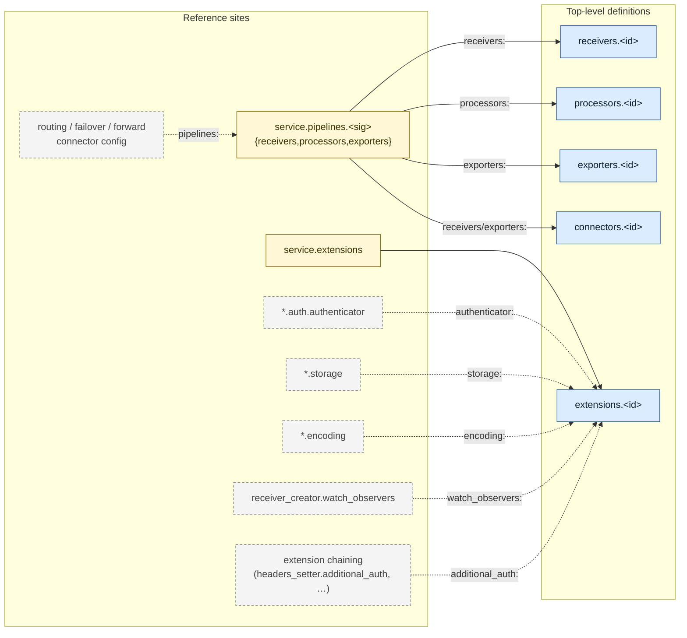

# Architecture

How `otelcol-lang` is put together: the repo layout, the LSP server and its settings, cross-file reference resolution, and the editor-injection design.

## Repo layout

```
otelcol-lang/
├── package.json                              Shared manifest: VS Code extension + npm bin for the LSP server
├── syntaxes/
│   ├── otelcol-yaml.tmLanguage.json          YAML + OTTL injection (VS Code + JetBrains)
│   └── ottl.tmLanguage.json                  vendored from ottl-lang
├── src/
│   ├── common/                               shared YAML classifier (sniffer)
│   └── server/                               LSP server (transport-agnostic)
├── bin/
│   └── otelcol-language-server                stdio shim used by Zed/Helix/JetBrains/Neovim
├── editors/
│   ├── vscode/                               VS Code extension (client + tests + language-configuration)
│   ├── zed/                                  Rust → WASM extension + language config + queries
│   ├── helix/                                languages.toml + runtime/queries/
│   ├── jetbrains/                            Gradle/Kotlin LSP4IJ plugin
│   └── neovim/                               notes (no shipped integration)
├── schemas/                                  vendored from otelcol-schemas
│   ├── distributions/                         per-distribution component metadata index
│   └── json/                                  publishable JSON Schemas + catalog
├── scripts/
│   ├── copy-schemas.mjs                      copies schemas into out/ or dist/ at build time
│   ├── check-runtime-paths.mjs               build-time sanity check
│   ├── smoke.mjs                             headless validator
│   └── smoke-stdio.mjs                       end-to-end stdio handshake smoke
└── test/                                     shared fixture workspaces (simple/, complex/, configsets/)
```

The LSP server (`src/server/`), shared YAML classifier (`src/common/`), TextMate grammars (`syntaxes/`), and test fixtures (`test/`) live at the repo root and are reused across every editor. Cross-editor design notes: [`editors/SHARED.md`](../editors/SHARED.md).

## LSP

The extension picks a distribution via the `otelcol.distribution` setting (enum of the registry slugs; default `otelcol-contrib`). On config change the server reloads its component index. All other features (hover with codeowners / warnings / feature gates from `metadata.yaml`, pipeline graph validation, OTTL forwarding) are distribution-agnostic.

### Settings

| key                                  | description                                                                                    |
| ------------------------------------ | ---------------------------------------------------------------------------------------------- |
| `otelcol.distribution`               | Which distribution to validate against (default `otelcol-contrib`)                             |
| `otelcol.schemaSource`               | Reserved for future use (HTTPS URL or release tag for schemas). No effect in v0.1.0.           |
| `otelcol.contribPath`                | Optional local contrib checkout for richer hover (rare)                                        |
| `otelcol.ottlLspPath`                | Path to `ottl-lsp`'s compiled `server.js` for embedded OTTL diagnostics                        |
| `otelcol.configSets.autoDiscover`    | Discover config sets by walking the workspace for `service.pipelines` anchors (default `true`) |
| `otelcol.configSets.maxFilesScanned` | Safety bound on the workspace walk (default `2000`)                                            |
| `otelcol.trace.server`               | LSP trace verbosity                                                                            |

## Cross-file references

The LSP resolves IDs across every member of a discovered **config set** (anchored on `service.pipelines:`, members are sibling fragments and subdirectory files; explicit overrides via `configset.otelcol.yaml` sidecar or first-line `# configset-otelcol:` directive). The graph below shows which reference sites resolve to which definition maps. Solid edges are implemented today; dashed edges are upstream patterns on the roadmap.


```mermaid
flowchart LR
    classDef def fill:#dcecff,stroke:#2c5b9a,color:#0b1d33;
    classDef ref fill:#fff7d6,stroke:#8a6d00,color:#3a2f00;
    classDef todo stroke-dasharray: 4 3,fill:#f4f4f4,stroke:#888,color:#444;

    subgraph defs [Top-level definitions]
        R["receivers.&lt;id&gt;"]:::def
        P["processors.&lt;id&gt;"]:::def
        E["exporters.&lt;id&gt;"]:::def
        C["connectors.&lt;id&gt;"]:::def
        X["extensions.&lt;id&gt;"]:::def
    end

    subgraph refs [Reference sites]
        PL["service.pipelines.&lt;sig&gt;<br/>{receivers,processors,exporters}"]:::ref
        SE["service.extensions"]:::ref
        RC["routing / failover / forward<br/>connector config"]:::todo
        AUTH["*.auth.authenticator"]:::todo
        STOR["*.storage"]:::todo
        ENC["*.encoding"]:::todo
        WO["receiver_creator.watch_observers"]:::todo
        XC["extension chaining<br/>(headers_setter.additional_auth, …)"]:::todo
    end

    PL -- receivers: --> R
    PL -- processors: --> P
    PL -- exporters: --> E
    PL -- receivers/exporters: --> C
    SE --> X

    RC -. pipelines: .-> PL
    AUTH -. authenticator: .-> X
    STOR -. storage: .-> X
    ENC -. encoding: .-> X
    WO -. watch_observers: .-> X
    XC -. additional_auth: .-> X
```

### What's wired today

| Reference site                                             | Resolves to                                                 | Features                                     |
| ---------------------------------------------------------- | ----------------------------------------------------------- | -------------------------------------------- |
| `service.pipelines.<sig>.{receivers,processors,exporters}` | `receivers` / `processors` / `exporters` / `connectors` map | hover, F12, find-refs, codelens, diagnostics |
| `service.extensions`                                       | `extensions` map                                            | hover, F12, find-refs, codelens, diagnostics |

Diagnostics include: undefined reference, ambiguous reference (duplicate id across files), defined-but-unused (greyed via `DiagnosticTag.Unnecessary`), and signal-compatibility checks for pipeline refs.

### Roadmap (dashed edges)

Each remaining pattern is a single string field whose value names a component id (or pipeline id for routing-style connectors). The shape mirrors `service.extensions:`, so adding them is mechanical: parse the ref into `DocModel`, union into `SetModel`, branch in `pipelineRefsTo`, extend the validator. See `src/server/usage.ts` and `src/server/yaml-model.ts` for the existing pattern.

## Design

The extension follows the language-injection + virtual-document pattern (YAML grammar injects `source.ottl` into OTTL-bearing keys; LSP forwards each OTTL string to `ottl-lsp` and translates diagnostic ranges back). Distribution support is layered cleanly on top: the schemas live in their own repo, and the LSP just consumes the generated per-distribution index at runtime.

### Single server, multiple editors

`src/server/` is a stdio language server built with esbuild into a single `dist/server/server.js`. Every editor frontend talks to the same bundle:

- **VS Code**: `src/extension/extension.ts` spawns it via `vscode-languageclient/node`.
- **JetBrains**: `editors/jetbrains/` uses LSP4IJ; `OtelcolLspServerFactory` constructs the `node server.js --stdio` command line.
- **Zed**, **Helix**, **Neovim**: point at the same `server.js` (or the `npm i -g` global) via stdio.

A bug fix or feature lands in one place and reaches every editor on the next `make bundle`.

### Completion contexts (`src/server/completion.ts`)

Five branches, all driven by `pathAtPosition` (indent-aware, handles blank-line cursors that the YAML AST has no node for):

1. **Value position**: cursor after `key: ` on the same line. If the key's resolved schema has an `enum`, surfaces those values.
2. **Top-level component map** (`receivers:` / `processors:` / etc.): suggests known component types from the distribution index.
3. **Inside a component instance** (`receivers.otlp.<cursor>`): walks the JSON Schema along the trailing path (`resolveRef`, `lookupProperty`) and emits property keys with `detail` (type/format/enum preview), markdown `documentation`, and snippet `insertText` that pre-fills schema defaults for scalars and expands `object` / `array` types onto an indented child line.
4. **`service.pipelines.<sig>`**: the bucket names `receivers`, `processors`, `exporters`.
5. **`service.pipelines.<sig>.{receivers,processors,exporters}`**: the defined IDs (cross-file aware via the set model).

Snippets use `\t` for the body indent so LSP clients expand it relative to the cursor line. Emitting literal spaces double-indents on most clients.

### Configuration sets

`src/server/set-model.ts` discovers sibling `*.otelcol.yaml` files that share a `service.pipelines` anchor and unions their definitions. Hover, go-to-definition, find-references, and completion all consult the set model so an exporter declared in `exporters.otelcol.yaml` is resolvable from a `pipelines.otelcol.yaml` reference.

### Editor-side specifics

- **Content sniffing** (VS Code): `src/extension/sniffer.ts` retags `*.yaml` files as `otelcol` when their content matches; the LSP server runs the same sniffer on the server side for editors that can't retag (`otelcol.sniffer.serverSide`).
- **Semantic tokens**: VS Code consumes the LSP semantic-tokens response directly; JetBrains adds `OtelcolSemanticTokensColorsProvider` to map the LSP token types onto the user's theme palette (otherwise LSP4IJ renders them as plain text).
- **Dev auto-restart**: both VS Code (`fs.watch` gated on `ExtensionMode.Development`) and JetBrains (`OtelcolDevWatcher` gated on an override path being set) watch `dist/server/server.js` and restart the client on change. Pairs with `npm run watch`. See [BUILD.md](BUILD.md#jetbrains) for the dev-loop details.

---

## File detection

Whether a YAML file is classified as an OpenTelemetry Collector config and
handed to the LSP involves two distinct stages that run at different points in
time and in different processes.

**Stage 1 — Editor layer** runs on every file open and answers _"is this file
otelcol?"_. The result is a `languageId` assignment (or rejection). This is
where the 5-rule detector fires, and where each editor differs.

**Stage 2 — LSP layer** runs after the server accepts the file and answers
_"what configset does it belong to?"_. The result is cross-file reference
resolution (hover, go-to-definition, diagnostics). This stage is identical
across all editors because it lives entirely in the shared server.

### Stage 1: the standard detection rules

The canonical detector lives in `src/common/yaml-sniff.ts`
(`looksLikeOtelcol`) and `src/common/yaml-classify.ts` (`classifyYaml`).
Every editor integration targets this behaviour — either by calling the shared
code directly (server-side path) or by porting it to the editor's own language
(JetBrains Kotlin port). Rules are applied in order; the first match wins.

| #   | Rule                   | What is checked                                                                               |
| --- | ---------------------- | --------------------------------------------------------------------------------------------- |
| 1   | **Directive marker**   | `# configset-otelcol:` comment present anywhere in the first 16 KB                            |
| 2   | **Sidecar filename**   | Basename is exactly `configset.otelcol.yaml`                                                  |
| 3a  | **Anchor structure**   | Top-level `service.pipelines:` key exists                                                     |
| 3b  | **Fragment structure** | ≥ 2 top-level keys from `{receivers, processors, exporters, connectors, extensions, service}` |
| 4   | **Sibling sidecar**    | A `configset.otelcol.yaml` file exists in the same directory                                  |
| 5a  | **Sibling directive**  | A sibling YAML's `# configset-otelcol:` names this file                                       |
| 5b  | **Sibling anchor**     | A sibling YAML has `service.pipelines:` at its root                                           |

Rules 1–3 are pure content checks (fast, no filesystem I/O beyond reading the
file itself). Rules 4–5 involve a bounded sibling scan (capped at 50 files)
and only fire for single-key fragments (exactly 1 otelcol top-level key); a
file with zero otelcol keys is rejected before the scan runs.

### Stage 2: configset discovery (LSP, all editors)

After the editor assigns `languageId = "otelcol"`, the server's
`ConfigSetIndex` (`src/server/configset.ts`) uses the same `classifyYaml`
primitive to stitch related files into a single virtual config set:

- A file whose `classifyYaml` returns `hasPipelines: true` is the **anchor**.
- Files named in its `# configset-otelcol:` directive are **explicit members**.
- A `configset.otelcol.yaml` sidecar in the same directory lists members by
  filename (rule-2 sidecar is the sidecar manifest, not a config fragment).
- All YAML files in the workspace that share any of the above relationships
  are unioned into one set model for hover, go-to-definition, find-references,
  completion, and diagnostics.

This stage is **editor-agnostic** — it runs identically in all four
integrations because it lives entirely in the shared LSP server.

### Per-editor coverage

| Mechanism                                   |    VS Code     |   JetBrains    |          Zed          |  Helix  |
| ------------------------------------------- | :------------: | :------------: | :-------------------: | :-----: |
| `*.otelcol.yaml` / `*.otelcol.yml` glob     |       ✅       |       ✅       |          ✅           |   ✅    |
| `first_line` / `firstLine` pattern (rule 1) |    ✅ auto     |   ✅ sniffer   | ✅ path-suffixed only |   ❌    |
| Content sniff rules 3a–3b                   | ✅ client-side | ✅ client-side |        opt-in¹        | opt-in¹ |
| Sibling scan rules 4–5                      | ✅ client-side | ✅ client-side |        opt-in¹        | opt-in¹ |
| Configset stitching (stage 2)               |     ✅ LSP     |     ✅ LSP     |        ✅ LSP         | ✅ LSP  |

¹ Enable `otelcol.attachToYaml: true` in LSP settings and route `*.yaml`
files to the server (via `file_types` in `.zed/settings.json` or Helix's
`language.file-types`). The server then runs `looksLikeOtelcol` server-side
on every incoming YAML document and silently drops non-matching files.

#### VS Code

`package.json` registers `"firstLine": "^#\\s*(otelcol\\b|opentelemetry-collector\\b|configset-otelcol:)"` on the `otelcol` language, so VS Code itself applies rule 1 before any extension code runs. The extension additionally subscribes to `onLanguage:yaml` and calls `looksLikeOtelcol()` on every YAML document at open-time (`src/extension/extension.ts:37-46`), retagging matching files via `languages.setTextDocumentLanguage`. This is the only integration where **all five rules run client-side** with no extra user configuration.

#### JetBrains

`OtelcolFileType` implements `FileTypeIdentifiableByVirtualFile` — a JetBrains hook that runs before normal name matchers, allowing the plugin to claim a plain `*.yaml` file that the YAML plugin would otherwise own. `isMyFileType()` fast-paths glob-matched files (rules 2 + filename), then falls through to `looksLikeOtelcol()` — a **Kotlin port** of the TS function in `OtelcolFileType.kt:43-79`, explicitly kept in sync rule-by-rule. Full parity with VS Code; all five rules run client-side.

#### Zed

`languages/otelcol/config.toml` registers `path_suffixes` (rules 2 + filename) and `first_line_pattern` (rule 1). Zed only evaluates `first_line_pattern` on files already matched by `path_suffixes`, so a plain `config.yaml` with a `# configset-otelcol:` directive is **not** auto-detected by the extension alone. Rules 3–5 are unavailable client-side (no Zed API for runtime document reclassification). The server-side `attachToYaml` path fills the gap.

#### Helix

`editors/helix/languages.toml` registers `file-types` globs (`*.otelcol.yaml`, `*.otelcol.yml`) only. No `first-line-pattern` equivalent is configured. Detection is filename-only; the `# configset-otelcol:` directive and structural rules only take effect via the `attachToYaml` server-side path.

---

## LSP server delivery

The server is a single esbuild bundle (`dist/server/server.js`) with one stdio
entry point (`bin/otelcol-language-server.js`). How each editor obtains and
launches it differs; all four eventually run the same bytes.

### VS Code — bundled inside the `.vsix`

`dist/server/server.js` is packed into the extension by `vsce`. At runtime
`src/extension/extension.ts:120` locates it via
`context.asAbsolutePath("dist/server/server.js")` and spawns it over IPC
(the `vscode-languageclient` default transport). No Node binary resolution
needed — VS Code supplies its own Node runtime for extension host processes.

```
.vsix
└── dist/server/server.js   ← bundled by make bundle / vsce package
Extension host (VS Code's Node) → require()s extension.js → spawns server.js over IPC
```

### JetBrains — bundled in the `.zip`, extracted to disk

`make build-jetbrains` runs the Gradle `copyLanguageServer` task, which copies
`dist/server/` into the plugin JAR under `language-server/`. On first use
`OtelcolLspServerFactory.extractBundledServer()` extracts it to
`~/.cache/JetBrains/<product>/otelcol-language-server/<version>/server/server.js`
and writes a SHA-256 stamp; subsequent launches reuse the cache if the stamp
matches. Node discovery uses `EnvironmentUtil` to read the **shell-inherited
PATH** (GUI-launched IDEs on macOS/Linux otherwise see a stripped PATH that
excludes Homebrew/nvm/pyenv-installed nodes):

```
Override priority:
  PROP_COMMAND (-Dotelcol.lsp.command)  → full argv0, --stdio appended
  PROP_NODE    (-Dotelcol.lsp.node)     → explicit node binary
  shell PATH via EnvironmentUtil        → PathEnvironmentVariableUtil.findInPath("node")
  literal "node"                        → inherits child process env (last resort)

Server path priority:
  PROP_SERVER  (-Dotelcol.lsp.server)   → dev: source-tree bundle
  REG_SERVER_PATH (Help → Registry…)   → persistent user override
  extractBundledServer()                → default: plugin-packaged copy
```

### Zed — npm auto-install via Zed's bundled Node

`editors/zed/src/otelcol.rs` resolves the server in three tiers (first match
wins). After resolution the server is always spawned with `--stdio`.

```
Tier 1: lsp.otelcol.binary.path in settings.json
        → spawn that path directly (user-supplied args or default ["--stdio"])
          Zed bypasses the WASM resolver entirely; `arguments` is required.

Tier 2: worktree.which("otelcol-language-server")
        → a globally-installed copy on PATH wins (npm i -g opentelemetry-collector-config)

Tier 3: zed::npm_install_package("opentelemetry-collector-config", SERVER_VERSION)
        → installs into the extension work dir on first use
        → spawns zed::node_binary_path() with
          ["node_modules/opentelemetry-collector-config/bin/otelcol-language-server.js", "--stdio"]
        → status shown as "Checking for update…" / "Downloading…" in the LSP status bar
        → falls back to a previously installed copy on transient network failure
```

`SERVER_VERSION` is `env!("CARGO_PKG_VERSION")` — the Rust crate version,
which moves in lockstep with the npm package version via `prepare-release.sh`.
This ensures each extension release pairs with the server it was tested
against. The npm package name (`opentelemetry-collector-config`) differs from
the bin name (`otelcol-language-server`), which is why `npm_install_package`
must target the package rather than the binary.

### Helix — external binary on PATH (user-managed)

`editors/helix/languages.toml` sets `command = "otelcol-language-server"`.
Helix resolves this via a plain `$PATH` lookup at startup; there is no
download or extraction step. The user must have the npm package installed
globally (`npm i -g opentelemetry-collector-config`) or have a local binary on
PATH. No Node resolution is performed by the integration — Helix calls the
shim directly as an executable (`#!/usr/bin/env node` shebangs work because
the npm global install sets the executable bit).
